# Hyperion: Building the  **Largest In memory Search Tree**

## Introduction

​		索引在数据管理中起到很重要的作用，很多索引结构都会采用访问速度快而且内存消耗少的trie树，但一般常见的trie树索引结构都强调效率而忽视内存的效率，他们的效率虽然高，但内存的消耗比较大。这篇文章提出了一种新的树形结构----Hyperion，在效率上做到对范围查询和点查询都能够有比较好支持的同时，也实现了内存效率使用的极大提升。

整篇论文大体上可以分层三个结构：

* 对常见的trie树做一个调整，优化trie树的编码方式，从而减小对一棵trie树编码的开销。
* 为了减小由于内存分配而导致的碎片，Hyperion提出了一个量身定制的内存管理器，主要采用匿名内存映射的方式来实现内存分配。
* 对上述的结构从编码方式、查找性能、关键字预处理等方面做了一定的优化。

## 编码方式

​		我们通常用到的trie树结构如下图，但是这棵trie树有点问题，就是树的高度太高，不易于搜索，同时，每一个节点就存储一个关键字，同时节点内还会包含节点的孩子指针等元素据信息，导致一个节点存储一个关键字的效率比较低。在这里作者提出了容器的概念，容器可以存储字符串中连续的两个关键字，也就是16bit，且容器中可以有多个这样的16位的关键字序列，最多可以有65536个16bit的关键字序列。容器对应着图中用实现标出的框C1、C2以及C3。

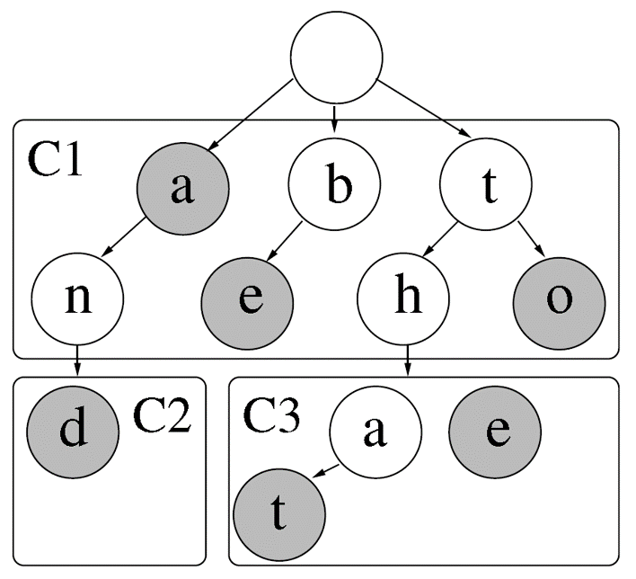

更进一步可以表示成下图所示，上图的容器全部表现成下面的形式，在容器内，连续的两个字符组成容器内的一个节点，如果末端只有一个，则用一个表示：

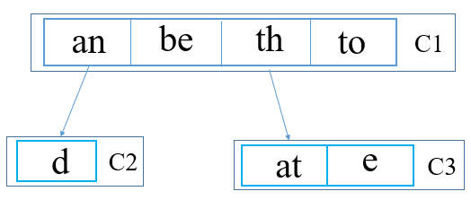

​	在图中，会发现一个问题，将连续的两个关键字的前缀作为一部分，后缀作为一部份，当容器内的某些关键字具有相同的前缀的时候，比如上图的th和to两个字符串有相同的前缀"t"，使得t被重复的存储，为了避免浪费这种重复存储所消耗的空间，在这里作者使用了如下的结构，将连续的两个字符分为两部分$k_i^0k_i^1$，即对应着T-Node($k_i^0$)和S-Node($k_i^j , j=1,2,3,...$ )，其中T-Node是连续两个字符的第一个字符，比如上图的a，b，t；而S-Node则是以第一个字符为前缀的后缀集合，还是以th和to为例，它们的前缀是t(T-Node)，则S-Node是h和o，示例如下：

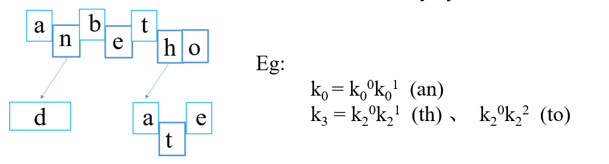

​	下面开始对这个容器就行的编码，首先对容器内的T-Node和S-Node进行编码，两种Node的编码格式如下：

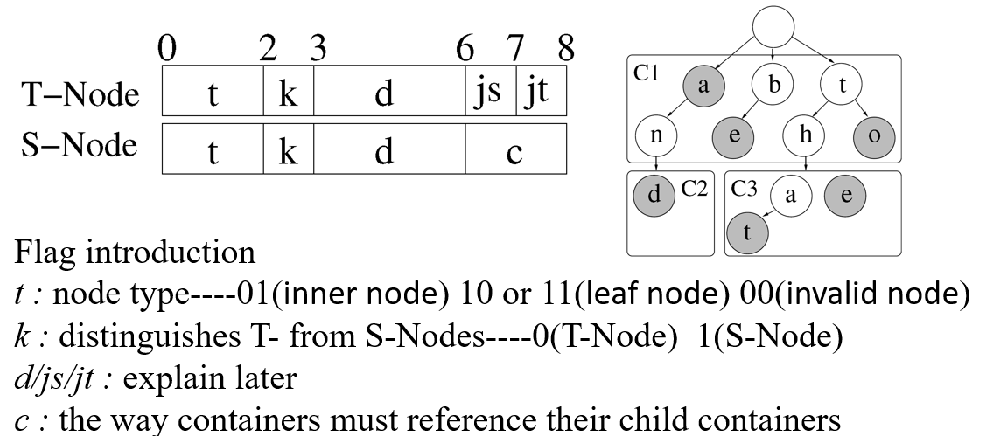

第一个标志位表示类型，占两个比特大小，10和11表示叶子节点（是否带值，对于这个标记还有疑问，但对文章影响不大），00表示指向无效的内存位置比如标志内存碎片等等（相当于网络传输包的EOF标志），其他节点都是内部节点，用01表示。标记位k表示节点是T-Node(0)还是S-Node(1)类型，C表示容器与容器之间的关系，下一段介绍，例如下面这两种情况对他们的编码如图所示。

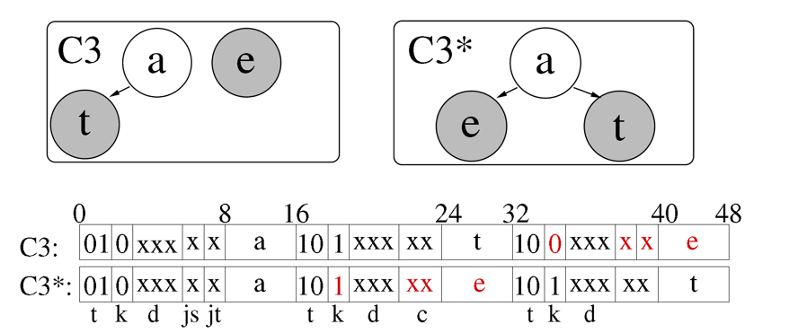

​		容器与容器的关系可以分为四种，占两个比特，用S-Node的c去表示，c=00时，表示容器已经到达最低端，下面再也没有其它容器了；c=11时，表示会采用一种压缩路径的方法去处理下一个容器，当trie树结构如下图所示时，就会采用。

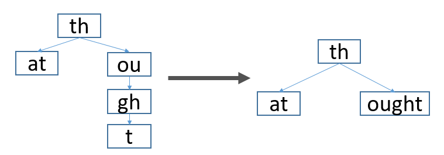

c等于01的时候，表示正常的引用子容器的地址，其中子容器的地址大小是5个字节，为什么是5个字节具体在后面的内存管理器介绍。C=10 的时候，表示大容器里面嵌入了一些小容器，这个小容器就直接连在了S-Node的后面，两种情况的编码方式具体如下图。

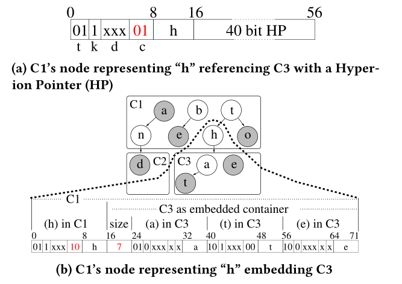

container与container的嵌入关系还可以这样表示更复杂的形式如下：

最后再介绍一下container的整个结构，Container头部包含Size（已经分配的内存大小），Free（剩余的内存大小），J（容器跳表标志位，后面介绍），S（延迟位，作为一个容器分裂的参数），而payload则存放的是跳表信息，在payload之后就开始对结点进行编码：

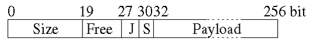

当一个容器中嵌入的容器数目过多，导致容器的存储容量过大的时候，就会进行分裂，分裂的条件如下：
$$
size_c >= a+b*s 
$$
在作者的系统中a=16Kib，b=64Kib，其中延迟参数s在container中可以设置，因为s在container的编码中只占两位，所以值只在0-3内。一旦开始分裂，分裂的过程以下图为例，首先会为这个容器申请一块新的内存，同时初始化容器的头部参数，然后调用memory_copy函数，将容器的payload复制到新的容器中，将头部参数的值更新，之前那部分空间被释放后，就需要将后面的内容往前移，同时将容器尾部空间的那一块内存初始化。

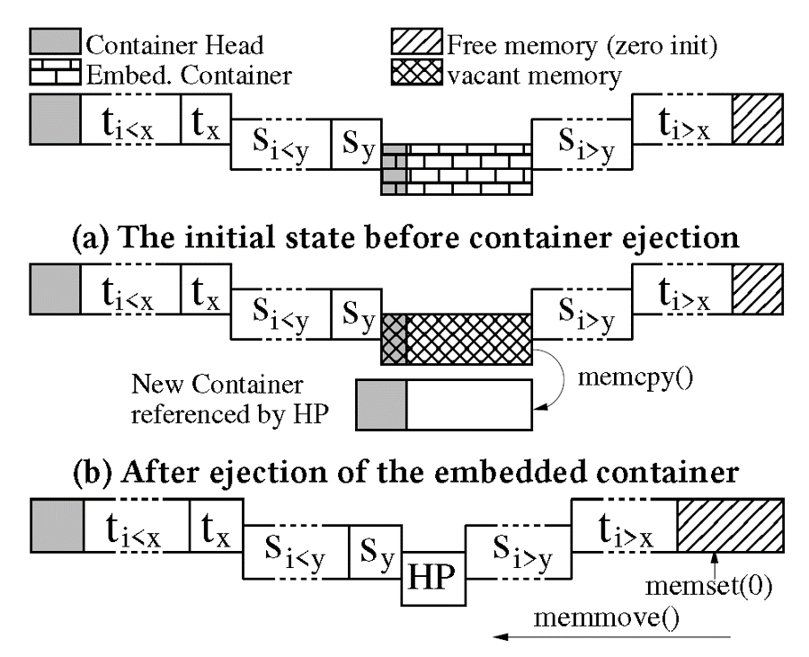

## 内存管理

​	介绍了容器与节点这种紧凑的编码方式之后，文章为Hyperion设计了一个内存管理器，因为不断的使用堆去分配内存会造成外部碎片。在Hyperion的内存管理器中，为了避免这些内存碎片，于是主要使用匿名内存映射的方式去申请内存，采用这种方式申请内存的时候会返回一个与页对其的内存块。在申请内存大小小于2016个字节的时候，采用刚刚说过匿名内存映射的方法，大于2016个字节的时候，还是采用堆分配的方式去申请内存，因为通过堆申请内存比较快，内存管理器采用分层结构去定位已事先分配好的内存块，如下图：

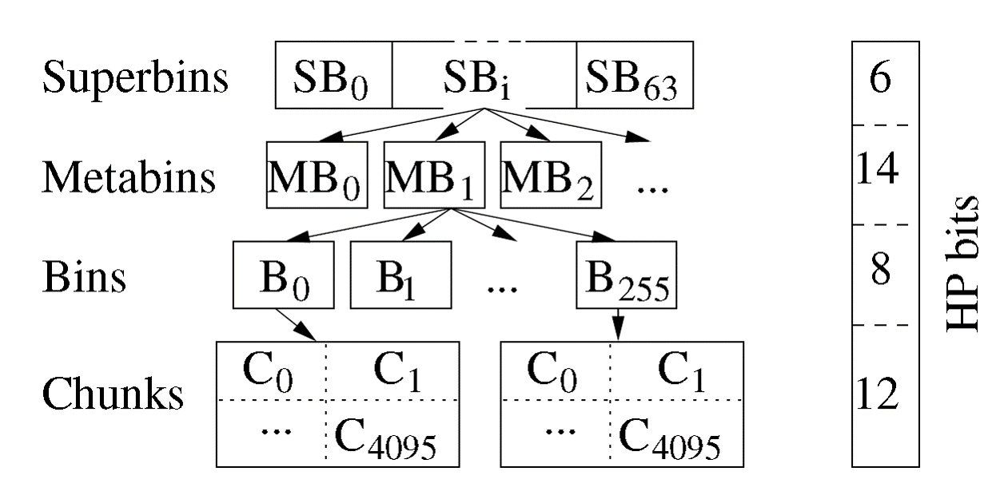

内存管理器的最上层有64个superbin，每一个superbin下面的chunk大小不一样，从superbin1到superbin63依次按32个字节的大小递增，其中superbin1的每一个chunk大小是32byte。而SB0的chunk是大于2016byte的（即刚刚说的采用对分配的方式去分配，因为对分配的方式比较快，而且对于大块内存不易产生外部碎片）。每一个superbin中有2的14次方个metabin，而每个metabin有256个bins，每一个bins则有2的12次方4096个chunk。通过这个内存管理器，定位一块内存空间只需要5个字节的大小。

​	使用这个内存分配器后，不仅可以减少内存中外部碎片的数量，还可以减少一些内存开销，比如通常在一台64位的机器上，指向某一块内存的指针大小通常是8字节，在这里只需要5个字节。第二个就是使用堆分配内存的时候，还要额外的花费8字节去存储这个堆的元素据信息。最后就是在这个内存管理器的每一层，都会维护一个数组去标记还有空chunk的superbin/metabin/bins，这样可以快速的去定位空的内存块，从而去申请内存。

​	这里要注意的是SB0，它处理的是申请的内存大于2016byte的请求，它下面的bin被称为Extended Bin，与普通的bin不同，它是包含了一个普通指针（8字节）和其他字段的bin（共16字节），它分配的chunk大小也是随着请求的不同，内存块大小的递增速度申请也不同。Chained Extended Bins (CEB)是SB0中连续的8个内存块，通过一个chained point去引用，并且这八个内存块统一由它管理，这样就避免了在容器分裂的时候不用在trie树中再把这些分裂的指针添加进节点里去，避免一些繁杂的内存移动操作和一些更新开销。

## 性能和内存优化

​	为了提升性能和减少内存空间，作者又几种方法去优化。

### Delta Encoding(d)
​	同一层的节点之间按升序排列，可以对他们进行增量编码，就比如这两个图，超过了3bits的表示范围，无法做Delta Encoding。此时将标值d全部置为0，将增量写道原先存值的位置。

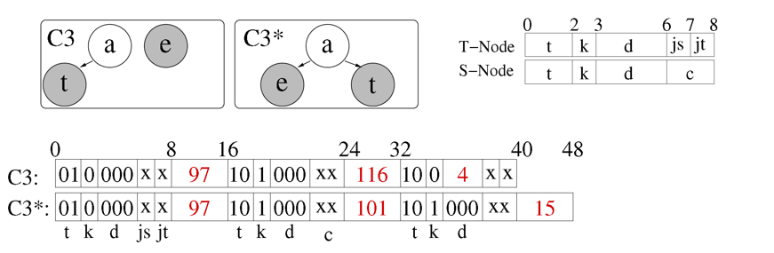

### 2.Jump Successor (js)

​	第二个优化是在T-Node中维护了一个Jump Successor，用来从一个T-Node直接跳到下一个T-Node，而不需要遍历该T-Node下的S-Node，从而才能找到下一个T-Node的位置。若T-Node的js标记1说明使用了Jump Successor，此时该T-Node后面有一个16bits的reference，存储下一个T-Node距离该T-Node的距离。

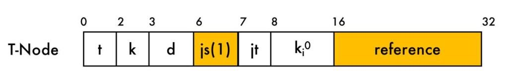

### 3. Jump Tables

JumpTable有两类，第一类是在T-Node中的T-Node jump table，第二类则是在容器内的Container Jump Table。

#### T-Node jump table

​	如果T-Node的jt位设置为1，表明T-Node启用了jump table这个表。T-Node jump table是一个长度是15的数组，（数组的每个元素占用2B。）它将S-Node所有可能的范围【0-255】等分成16份，记录每一位置相对T-Node的偏移量，从而可以快速的从T-node到S-Node的访问。

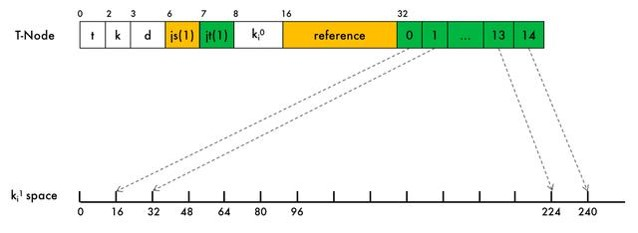

#### Container Jump Table

​	这里的Container Jump Table是为了在容器中快速定位T-Node，J占了3bits，最大表示7，每一个表示7个Entries，因此最多表示49个Entries。每个Entry占用4B，1B存储T-Node的Key，3B的Offset用来定位T-Node的位置，可以直接利用这个表定位到最接近目标T-Node的位置. 

​	如图，这里的J设置为2，则表示有2*7=14个，就会将容器中所有的T-Node等分14分，然后在数组中记录每一份的关键字以及它的偏移量。

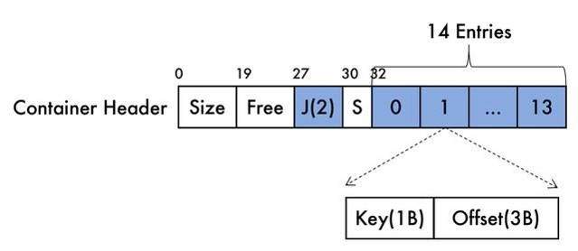

### Key Pre-processing
 这是一个可选项，关键字预处理函数的作用就是为了将关键字通过一定的函数转换后得到的值更加符合我们所期望的分布，比如一些原来很分散的数据，通过一些函数处理后，可以让这些数据的分布变得紧密。通常，关键字的预处理函数是一个单射函数。对于范围查询来说，还要求经过单射函数得到的值也要满足原先关键字所遵守的顺序。在Hyperion中，作者使用的方法是在第二，第三，第四个byte中插入两个0，这样就会使得容器的数量由2（16）*2（16）=2（32）个容器减少到2（14）*2（12）=2（26）个。可以使得一个容器放入更多的关键字信息。

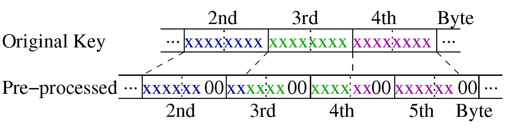