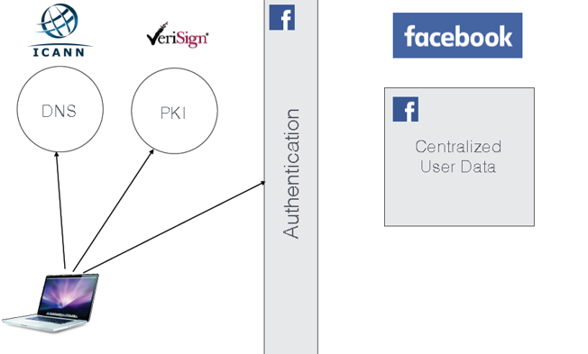
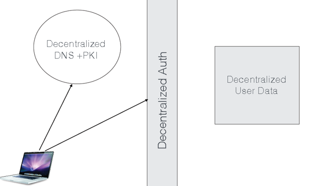
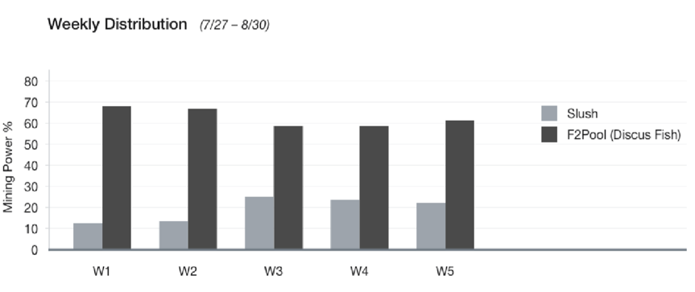
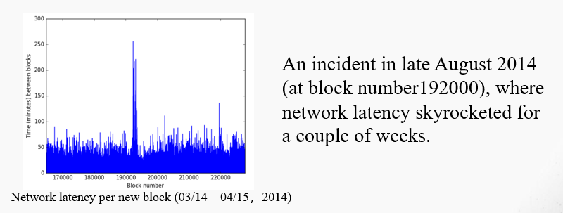
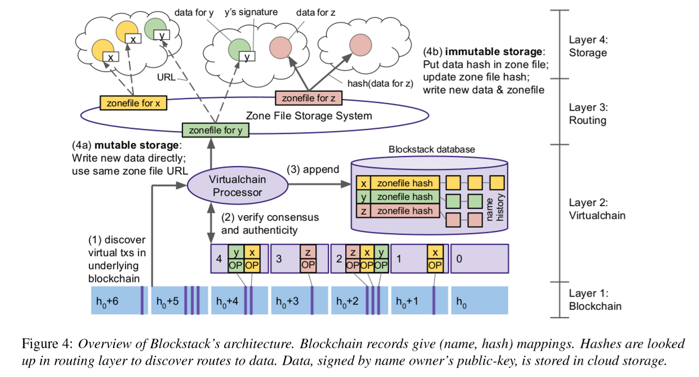
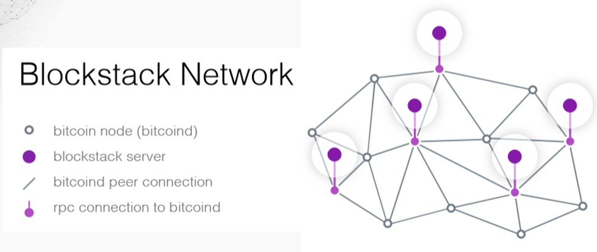
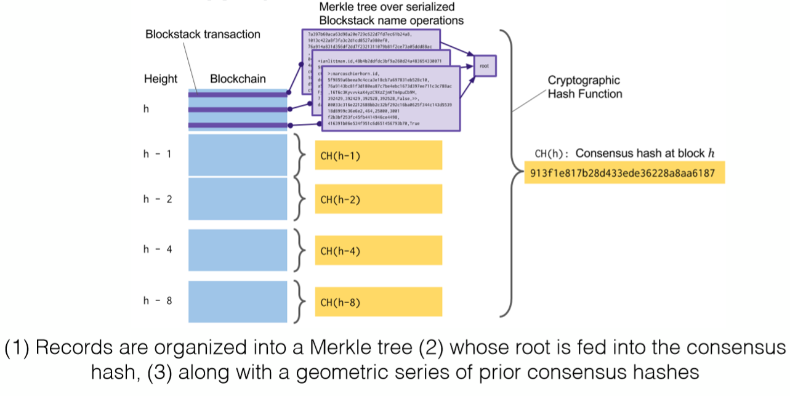
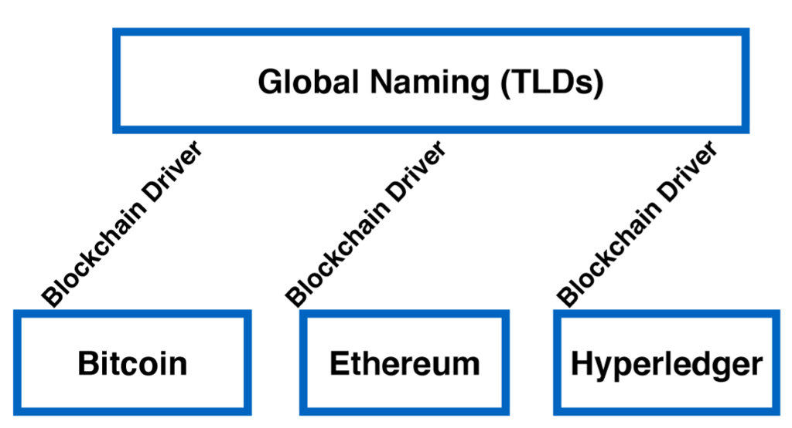

# **Blockstack**: A Global Naming and Storage System Secured by Blockchains

*作者：Muneeb Ali, Jude Nelson, Ryan Shea, and Michael Freedman Blockstack Labs and Princeton University (USENIX ATC 16)*

### **1.  Motivation**

​	当我们想要访问facebook的个人数据的时候，我们通常会在浏览器下输入facebook的域名，这个时候我们会首先访问DNS服务器，将域名转化为ip，然后再去访问facebook服务器所在的ip地址，在这个过程中，域名的管理机构比如verSign（威瑞信）有一套pki体系会验证域名是否合法，这两步都完成之后，我们就可以去访问到自己的数据。如下图所示：

因为有时候中心化的第三方经常会发生数据泄露的事件，因此作者提出一个系统想把这些过程全部变成去中心化的过程。这个系统可以让用户注册一个唯一且人类可读的用户名和与用户名相联系的公钥，同时将用户产生的数据与用户名和公钥绑定。将上面的过程简化成如下形式：

### 2. Background

​	作者首先想到的是NameCoin这个系统，NameCoin是从Bitcoin上fork下来的一个分支，在它上面做了一些业务上的修改，它是除了比特币外运行最久的一个区块链系统。

​	NameCoin的作用提供传统DNS（域名管理系统）服务商类似的功能，但与传统系统不一样的是Namecoin基于去中心化的区块链，是一种分散式的DNS，它将域名与IP映射的信息全都存在了区块链上，这样可以阻止网络审查，保证信息自由发布。我们常用的com和cn的DNS服务商分别由美国和中国控制，所以政府可以审查网站内容，甚至关闭。但现在NameCoin把域名和IP的映射信息全都存在区块链上，不允许其修改，

#### 一些问题

**a. 区块链的安全问题**

​	这个系统首先在nameCoin上运行，出现了一下这些问题：首先是区块链的安全问题，NameCoin的使用的整体算力不是很高，而且是基于比特币的区块链，很容易出现单个矿池掌握百分之51以上的算力，比如上图就是两大矿池在2015年的七八月份出现挖矿的算力比例。这样这个区块链很容易受到攻击。

**b. 一些未知的协议或者软件问题**

​	NameCoin因为不成熟会出现一些软件不稳定的问题，比如说可能会因为网络中的某些人发送的交易中数据字段很多，区块在打包这个交易时花费的时间很长，会导致一些延迟问题。可以看出图中NmaeCoin这个系统在2014年的时候在产生第19200个区块的时候，有很大的网络延迟。

**c.网络吞吐量的降低**

​	有些大型的矿池有意或者因为其他原因无法把交易打包进他正在写的区块，这些交易就只能由其他的矿工来完成打包任务，这个时候网络的吞吐量就会大大下降。

### **3. Design of Blockstack**

​	作者根据以上问题，发现这个NameCoin系统的性能和安全性有很大的问题，这个时候要寻找一个安全稳定的区块链，但发现这种要求的区块链只有目前比较成熟的比特币和以太坊等。于是作者就想把业务层和区块链分离开来，底层使用原有的BitCoin系统。作者在这里提出了一个blockstack的分层结构，将系统分成了两层—控制层和数据层。其中控制层中包含了一层单独的区块链层以及还有一层定义了注册用户，用户公私钥的创建，以及一些与用户名绑定的hash函数的创建的业务层，数据层主要负责数据的存储。整个系统架构如下：

​	其中控制层分为两层，一层是区块链层，另一层是虚拟链层；数据层也分为两层，分别是路由层和存储层。

**a. 区块链层**

​	第一次：区块链层，它负责存储blockstack的一些操作序列，同时就这些操作序列的顺序一致提供共识。作者在blockstack系统中将该层的区块链系统设置成了bitcoin，因为bitcoin相对其他的区块链来说运行的时间最长，稳定性比较好。系统会把这些操作序列处理成bitcoin所能接受的交易的形式保存在区块链上，

**b. 虚拟链层**

​	虚拟链定义了blockstack上的操作序列，比如创建用户，插入数据，删除数据等等这些操作序列，这个操作序列可以看成一种状态机，比如图中这些都是针对用户x,y,z的操作序列，当bitCoin中有一个新区快产生的时候，blockstack会去读取该区块，从其中找到可以接受的交易传到虚拟链这一层。在将这些操作序列接收之前，会检查系统的blockstack是系统否达成共识，即系统会验证系统当前的操作序列是否保持一致，然后验证用户名下面的加密地址是否一致。如果这些都没有问题，就会将这些操作信息存入blockstack数据库，数据的组织形式和图上一样，一个域名，也就是用户名，加密地址，zonefile的hash值。

**c. 路由层**

​	刚才说到了，虚拟链层存储了域名和对应的zonefile的hash，而zonefile实际上是存储在路由层的。

​	Zonefile在传统的DNS里指的是一组包含如何将网络域名转换为对应的IP地址的指令集，里面通常包含了域名对应的IP的信息。而在本系统中，zonefile和它的意义差不多，里面存放的是域名对应的数据存放在哪个云服务商的服务器里。

**d. 存储层**

​	存储层以key-value的形式存储真实的数据，这些数据都会被用户所拥有的公钥进行加密

整个系统架构部署在BitCoin上如下：

### 4. 全局一致HASH——**Simple Name Verification**

​	因为blockstack的底层采用的是其他的区块链系统，有可能一些节点没有在某些时刻达到一致，这个时候上层的blockstack需要验证一把。验证的办法如下：

​	验证全局一致hash的时候，它会将当前区块中与本系统相关的交易取出来同时加上之前区块已经计算过的针对对应块的Ph值，做一个共同的hash计算，这里要注意，它并不会遍历所有的区块，它只会遍历编号为h减去2的i次幂的区块。举例如下，现在只取一部分区块：

​	假设现在底层区块链的块高是h，先将块中是关于blockstack的交易取出来，组织成一棵默克尔树的形式，拿到根节点，然后再去将之前得到的块h-1,h-2,h-4,h-8的值做一个求和取hash的计算。就会得到快高为h的共识hash值了。

### 5. **Future Work**

​	未来的工作，因为现在系统的底层是BitCoin，作者想测试一下把它迁到以太坊，或者超级账本试一试，同时设想将这三个都作为底层的区块链系统试一试。

### 相关知识

**DNS**

​	DNS( Domain Name System)是`域名系统`的英文缩写，是一种组织成域层次结构的计算机和网络服务命名系统，它用于TCP/IP网络，它所提供的服务是用来将主机名和域名转换为IP地址的工作。

**DNS的查询过程**

假设现在我们要访问www . qq .com的过程。

1.在浏览器中输入www . qq .com 域名，操作系统会先检查自己本地的hosts文件是否有这个网址映射关系，如果有，就先调用这个IP地址映射，完成域名解析。

2.如果hosts里没有这个域名的映射，则查找本地DNS解析器缓存，是否有这个网址映射关系，如果有，直接返回，完成域名解析。

3.如果hosts与本地DNS解析器缓存都没有相应的网址映射关系，首先会找TCP/IP参数中设置的首选DNS服务器，在此我们叫它本地DNS服务器，此服务器收到查询时，如果要查询的域名包含在本地配置区域资源中，则返回解析结果给客户机，完成域名解析，此解析具有权威性。

4.如果要查询的域名，不由本地DNS服务器区域解析，但该服务器已缓存了此网址映射关系，则调用这个IP地址映射，完成域名解析，此解析不具有权威性。

5、如果本地DNS服务器本地区域文件与缓存解析都失效，则根据本地DNS服务器的设置（是否设置转发器）进行查询，如果未用转发模式，本地DNS就把请求发至13台根DNS，根DNS服务器收到请求后会判断这个域名(.com)是谁来授权管理，并会返回一个负责该顶级域名服务器的一个IP。本地DNS服务器收到IP信息后，将会联系负责.com域的这台服务器。这台负责.com域的服务器收到请求后，如果自己无法解析，它就会找一个管理.com域的下一级DNS服务器地址http://qq.com给本地DNS服务器。当本地DNS服务器收到这个地址后，就会找http://qq.com域服务器，重复上面的动作，进行查询，直至找到www.qq.com主机。

6、如果用的是转发模式，此DNS服务器就会把请求转发至上一级DNS服务器，由上一级服务器进行解析，上一级服务器如果不能解析，或找根DNS或把转请求转至上上级，以此循环。不管是本地DNS服务器用是是转发，还是根提示，最后都是把结果返回给本地DNS服务器，由此DNS服务器再返回给客户机。 

### 参考文献

[1] [DNS原理及其解析过程](https://www.cnblogs.com/gopark/p/8430916.html)

[2] *BlockStack:A* *Global* *Naming* *and* *Storage* *System* *Secured* *by* *Blockchains*. USENIX ATC ’16

[3] [Blockstack：只用一个数字ID行走区块链世界？](<https://bihu.com/article/1260288>)

[4] [Blockstack：给DAPP开发者和用户的便捷桥梁？](<https://bihu.com/article/1266468>)