## 1. Introduction

​	在数据库管理系统中查找某些关键字会导致很大的磁盘I/O开销，针对这一问题，通常会使用一个内存开销小并且常驻内存的过滤器来检测该关键字是否存。比如现在常用的bloom过滤器对判断某个key是否存在是非常高效的，其能用极少的空间（与key长度无关），极低的出错概率判断key的存在性。

​	现有的过滤器都仅仅支持point query，例如现在RocksDB里面有一张学生表，现在要做查询，找出年龄等于18岁的学术，我们可以通过在每一个SSTable（LSM Tree的分层结构）上加一个布隆过滤器减少磁盘IO，从而加速查找过程。但是现在查询请求变成了学生表中是否含有年龄段在22到25之间的学生，这个时候布隆过滤器就没有办法工作了。

​	本篇论文的核心是提出了一种基于succinct data structure的trie树，同时对该树进行合理的编码，从而降低占用内存的大小，同时保留查询能力，既支持point query，也支持range quey。

## 2. SUCCINCT RANGE FILTERS

​	为了在集合中查找字符串，首先想到的是Trie，一颗不做任何处理的Trie树如下图所示，

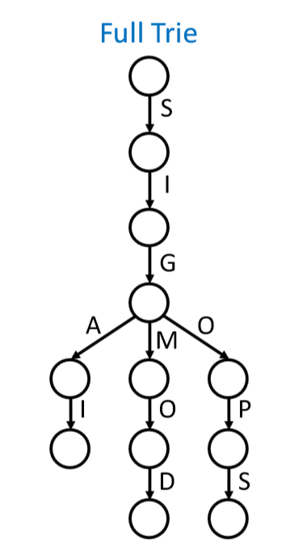

从起始节点到最底层的叶子节点存储了一个完整的key，所以它是完全精确的，在集合中查找某个字符串的时候，不会出现关键字是否存在判别错误的情况。但是它有一个缺点就是占用的内存空间太大。为了让这棵Trie树变小，就要去截断一部分后缀，只会保存最短的前缀且这个前缀可以与集合中其他元素不同，这棵Trie树被称为Surf-Base，如图所示：

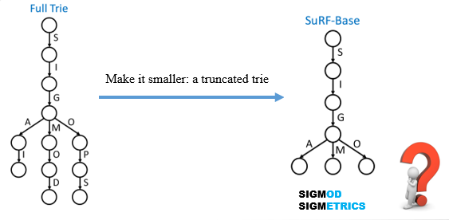

但是Surf-Base有个问题就是如果现在有一个字符串的前缀和树中存储的字符串前缀相同，但它又不在给定的字符串集合中，这时判别集合中是否有关键字的FPR(False Positive Rate)就会很高，比如通过上图右部的SuRF-Base去判别集合中SIGMETRIC是否存在，就会认为该字符串存在于该集合中，就会得到一种错误信息。为了降低FPR，作者对原来的SuRF-Base结构做了改进，提出了SuRF-Hash、SuRF-Real以及SuRF-Mixed三种结构。

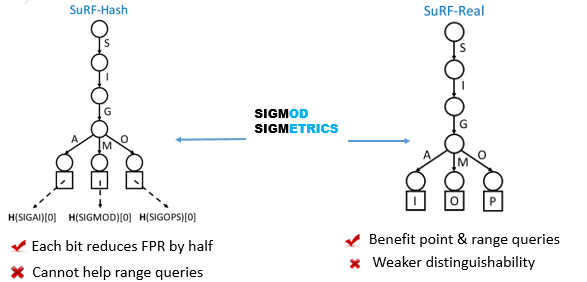

* SuRF-Hash(SuRF with Hashed Key Suffixes)：针对SuRF-Base有很高的FPR，在将集合中的关键字加入到SuRF-Base树的同时，也会对关键字进行hash计算，将得到的hash值的n个bit存储到最终的value中，当进行关键字的查找时，不仅要在Trie树上面查找，还要对比hash值。这种结构有利于Point查询，且保存的hash值每多一位，做Point quey的FPR就会减少一半。但是这个结构并不会对Range query有任何帮助，不能减少range query的FPR。

* SuRF-Real(SuRF with Real Key Suffixes)：和SuRF with Hashed Key Suffixes不同，SuRF-Real将存储的hash值的n个bit换成了真实key（即value中存放着key），例如上图的右部分表示添加了8bit的suffixes，这样虽然同时增强了Point query和Range query，但是关键字的区分度还是不高，在point查询下, 它的FPR比SuRF-Hash要高。

* SuRF-Mixed(SuRF with Mixed Key Suffixes)：为了同时享受Hash和Real两种方式的优点, Mixed模式就是将两种方式混合使用，存储的value中有一部分是real key，另一部分是hashed key，混合的比例可以根据数据分布进行调节来获得最好的效果。如下图是一个案例：

  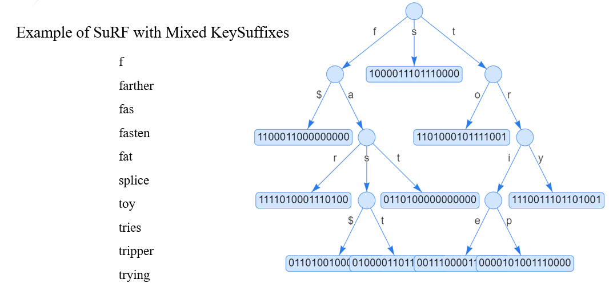

## 3. FAST SUCCINCT TRIES

### LOUDS编码

​	FAST SUCCINCT TRIES是作者提出来的一种对Trie树进行编码的方式，可以减小该树在内存中空间，同时保留了查询的能力。因为这种方式是基于LOUDS(Level-Ordered Unary Degree Sequence)提出来的，所以需要先了解LOUDS的编码规则：

* 从根节点开始，按广度优先的方式去遍历这棵树。
* 扫描到一个节点时，该节点有n个孩子，则用n个1和一个0对这个节点进行编码。

举例如下图所示：从根节点开始依次层序遍历这棵树，遇到一个节点，该节点有几个孩子，就用几个1再加上一个结束标志0对该节点编码，例如，对于节点3，它有3个孩子，就用“1110”对该节点编码。

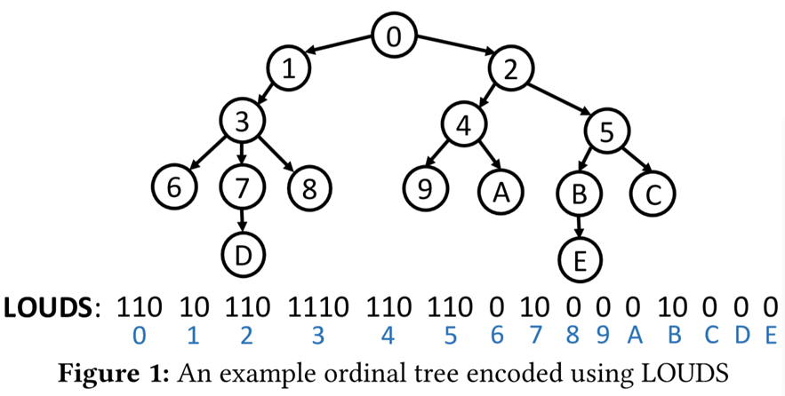

​	对这棵树编码完成后得到的是一组01字符串，现在要根据这个字符串来访问树中的节点，可以总结成两个经典的操作：

* 通过父亲节点找孩子节点
* 通过孩子节点找父亲节点

为了能够实现上述两个操作从而实现访问树中的任意节点，根据该树的编码特点以及字符串的形式，定义了四个操作：

* rank1(i) :  返回在 [0, i] 位置区间内 1 的个数

* rank0(i) :  返回在 [0, i] 位置区间内 0 的个数

* select1(i) :  返回第i个1的位置(整个bit序列)

* select0(i) :  返回第i个0的位置(整个bit序列)

上面的操作可以通过下面的表格来具体详细解释，其中value行的比特序列是上面那张图中的编码序列：

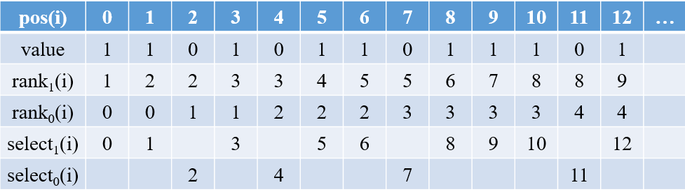

现在基于下面三个公式来访问整个树：

* 求层序遍历的第i个节点在比特序列中的位置

  ​			position(i-th node) = select0(i) +1   //因为节点间编码以0间隔开，所以当前序列位置前面有多少0，就表示有多少节点，第i个节点的位置，前面有i个节点（节点序号从0开始），及定位到第i个0，就可以定位到第i-1个节点编码序列最后一个比特在比特序列的位置，加1后就表示第i个节点的起始位置了。即可知，对任何一个位置来说，开始位置到该点之间的bit 0出现的个数表示该点前面有多少个节点。

* 求在比特序列中起始位置为p的节点的孩子位置

  ​			first-child(i) = select0(rank1(p)) + 1   //因为每一个节点都会通过1的个数去标记其直接孩子的个数，根据这个特性，对任何一个位置，开始位置到该点之间的bit 1出现的个数表示该点前面的节点加上其直接孩子的节点数目。

* 求在比特序列中起始位置为p的节点的父亲位置

  ​			parent(i) = select1(rank0(p))             //这个关系可以根据父亲求孩子来倒推。先求出该节点前面有多少节点，然后根据“对任何一个位置，开始位置到该点之间的bit 1出现的个数表示该点前面的节点加上其直接孩子的节点数目”。倒推父亲节点。

举例如下：

​			求第4个节点在编码序列中的位置：select0(4)+1 = 11 + 1 =12

​			求在比特序列中起始位置为12的孩子位置：select0(rank1(12)) = select0(9)+1 = 22

​            求在比特序列中起始位置为22的节点的父亲位置：select1(rank0(22)) = select1(9) = 12

### FST编码

基于LOUDS编码方式, FST( FAST SUCCINCT TRIES)对LOUDS进行了进一步压缩, 下图介绍了基本的压缩方法:

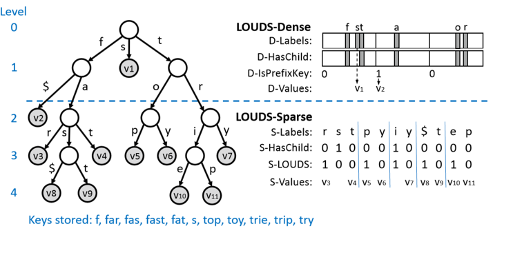

FST将LOUDS分成了两层, 上层节点数量少，数据访问频繁, 使用LOUDS-Dense编码方式, 下层节点数多, 数据访问次数少，使用LOUDS-Sparse编码方式.

#### LOUDS-Dense和LOUDS-Sparse

**1. LOUDS-Dense**

每个节点最多有256个子节点, 那么在LOUDS-Dense编码方式中, 每个节点使用3个256个bit的bit map和一个bit序列来保存信息. 它们分别是:

* D-Labels : 为节点中的每一个值做一个分支标记。例如根节点有以 f，s 和 t作为前缀的三个分支，那么会将这个大小为256的bit map的第 102（f），115（s） 和 116 （t）bit 位就会设置为 1。可以看到，具体哪一个bit 位，就是 ASCII 码的值。
*  D-HasChild : 标记对应的子节点是否是叶子节点还是中间节点。以根节点的三个分支为例，f 和 t 都有子节点，而 s 没有，所以 102 和 116 bit 都会设置为 1。
* D-IsPrefixKey : 标记当前前缀是否是有效的key。
* D-Values : 存储的是固定大小的 value，在本文中，表示的是指向之前说过三种后缀（hashed, Real, Mixed）的指针。

现在仍然可以使用select&rank操作来访问Trie树中LOUDS-Dense对应的节点：

* 求孩子节点：假设某一结点的label分支有节点，即对应的D-HasChild[pos] = 1，则对应的分支的孩子节点的位置是 `D-ChildNodePos(pos)=256×rank1(D-HasChild,pos)`

  举例：求根节点的中D-Label为t的孩子节点（D-HasChild(pos)=1）分支，Position(t) = 116，则：

  D-ChildNodePos(256)=256×rank1(D-HasChild,pos) =  256 * 2= 512  //第三个节点的起始位置为512。

  注：operator(seq,pos) 表示在序列seq上做operator操作，上式就是在D-HasChild中做rank1(pos)操作

* 求父亲节点：假设求pos=623(第三个节)的父亲位置：

  `D-ParentNodePos(pos) = select1(D-HasChild, ⌊pos/256⌋)`

  带入公式得D-ParentNodePos(pos) = select1(D-HasChild,⌊623/256⌋) = select1(D-HasChild, 2) = 116

**2. LOUDS-Sparse**

使用3个bit序列来对trie树进行编码, 在整个bit序列中, 每个节点的长度相同, 这三个bit序列分别是:

- S-Labels(bit-sequences) : 直接存储节点中的值，按照 level order 的方式记录了所有 node 的 label，用0xFF($)标记该前缀也是key节点（作用相当于LOUDS-Dense中的D-IsPrefixKey ）。
- S-HasChild(one bit) : 记录每个节点中的label是否含有分支子节点, 有的话标记为1, 每个label使用一个bit。
- S-LOUDS(one bit) : 记录每个label是否是该节点的第一个label。譬如上图第三层，r，p 和 i 都是本节点的第一个label，那么对应的 S-LOUDS 就设置为 1 了。
- S-Values : 存储的是固定大小的 value，在本文中，表示的是指向之前说过三种后缀（hashed, Real, Mixed）的指针。

使用select&rank操作来访问Trie树中LOUDS-Sparse对应的节点：

* 求孩子节点：假设某一结点的label分支有节点，即对应的S-HasChild[pos] = 1，则对应label分支的孩子节点的位置是:`S-ChildNodePos(pos) = select1(S-LOUDS,rank1(S-HasChild,pos) + 1)`

  例如，S-HasChild[5]=1，rank1(S-HasChild, pos) =  2 + 5 =7（这里要加上LOUDS-Dense上的D-HasChild），select1(S-LOUDS, 7 + 1) = 9（S-LOUDS主要代表节点的label边界，需要减去LOUDS-Dense上的3个节点，实际上求的是select1(S-LOUDS, 8-3)）

* 求父亲节点：假设求pos=623(第三个节)的父亲位置：

  `S-ParentNodePos(pos) = select1(S-HasChild, rank1(S-LOUDS, pos) -1);`

  例如，现在求pos = 9的父节点，rank1(S-LOUDS, pos) = 8（ rank1(S-LOUDS, pos) = 5 但是加上LOUDS-Dense上的3个节点）select1(S-HasChild,  7) = 6 （S-HasChild还包括了LOUDS-Dense上的D-HasChild）

### 性能分析

​	假设这棵Trie树有H层，LOUDS-Dense-Size(l) 表示从0到l（不包含l）层采用LOUDS-Dense编码，而LOUDS-Sparse-Size(l) 表示从l到H层采用LOUDS-Sparse方式编码，这棵树按多少比例采用两种方式去编码：

LOUDS-Dense-Size(l) × R  ≤  LOUDS-Sparse-Size(l)   //通常R默认值是64

于是，LOUDS-Sparse方式的编码大小会决定这棵Trie树的实际编码空间大小。现在给定n个个关键字的集合，S-labes需要使用8n个bits, S-HasChild和S-LOUDS一共使用2n个bits, 所以LOUDS-Sparse使用10n个bits。而Dense占用的空间要远远小于Sparse部分，所以整个LOUDS-DS编码的Trie树接近10n个bits。

## 性能测试

论文中使用了两组key的数据进行性能对比测试。 一组是由YCSB输出的64bit的整数， 另一组是由字符串组成的电子邮件地址,，其中整数的key有50M个，电子邮件地址组成的key有25M个。相关细节如下：

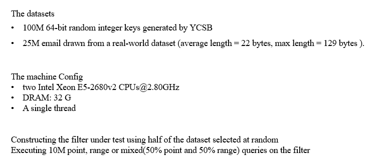

1. FPR对比

   首先对比了SuRF不同模式和布隆过滤器在FPR上的对比：

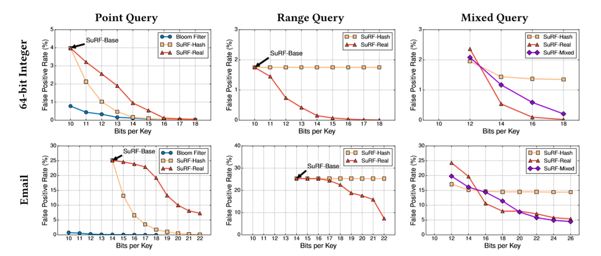

​	一般情况，在point query下，SuRF比bloom filter还是要差一些。从该图的中间部分可以看出，随着SuRF-Hash的hash后缀的bit位数的增加，它对range query起不到任何作用。该图的右侧的Mixed query说明，随着后缀的长度的增加，SuRF-Real对Point和Range query都可以增强作用，所以它下降的最快，而 SuRF-Hash只对Point query起作用，所以它的后缀增加到一定后，只是将Point query的FPR降低了，但是Range query的FPR不会变化，而在整数和Email的实验中SuRF-Real和SuRF-Mixed的变化趋势不同，是因为在整数中后缀添加一个bit，这个 值变化很大，区分度高，但是相对于字符串，特别是邮箱，后缀添加一个bit，即便是一个字节，区分度可能不高(比如ttttttx@cs.cmu.ed和tttttts@cs.cmu.ed)

2. 性能对比

   SuRF的不同模式和bloom filter的吞吐对比，吞吐实际上指的是查询速度。

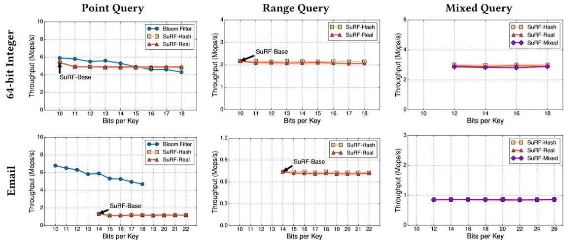

可以看出无论是Point，Range，还是Mixed Query下，SuRF的三种模式吞吐量差别不大，而且在做Point Query时，布隆过滤器的吞吐量还是相对高的。

**应用场景测试**

​	作者对RocksDB的过滤器做了些改动，提出了四种场景的RocksDB的测试案例

​			(1)no filter

​			(2)Bloom filter (14 bits per key)

​			(3)SuRF-Hash (4 bit suffix per key)

​			(4)SuRF-Real (4 bit suffix per key)

​	实验的数据集是100G，查询的key是随机产生的。作者首先做的是性能对比

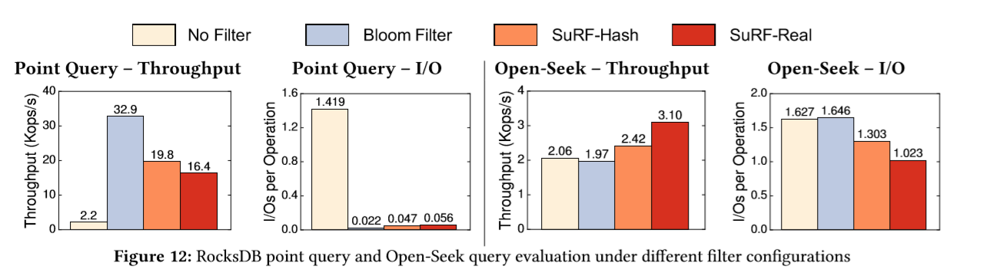

上图左侧表示的是Point query的性能对比，可以看出添加布隆过滤器后，查询时涉及的磁盘IO最少，它的吞吐量最大；图中右侧表示Range query的性能对比，此时SuRF的两种变体就有一些性能上的提升。

接下来作者为了更大程度的显示SuRF的优势，于是做一组关于在range query时，故意设置一些查询语句返回为空时的性能对比试验。并逐渐增加这些查询语句在所有查询语句的比例。

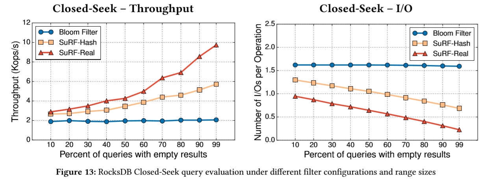

从图中可以看出随着查询中查询结果为空的比例不断增多，SuRF的性能就会不断的提升，而带布隆过滤器的SuRF的性能始终没有任何变化。

## 总结

* 文中的SuRF是一种即支持Point query又支持Range query的过滤器结构
* 如果具体应用中针对Point query的FPR的要求很高，布隆过滤器则比SuRF更好。但是如果查询中出现empty result的情况很多的话，且关注性能的提升时，可以使用SuRF结构。
* 可以调节SuRF-Mixed中后缀部分hashed  key和Real key的各自的长度，一般都是从SuRF-Real这种模式开始做调整，因为这种模式可以对Point query和Range query都很好，然后慢慢的逐步将Real 换成Hashed Suffixes。
* SuRF是常驻内存的，而且很高效，它的FPR可以通过调整后缀的长度来降低FPR。

## 参考文献：

HuanchenZhang. 2018. Sigmod. SuRF : Practical Range Query Filtering with Fast Succinct Tries

Guy Jacobson. 1989. Space-efficient static trees and graphs. In Foundations of Computer Science.IEEE,549–554.

[SuRF Demo](<https://www.rangefilter.io/>)