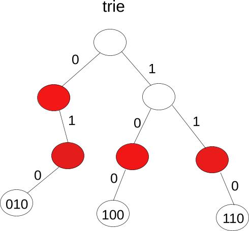
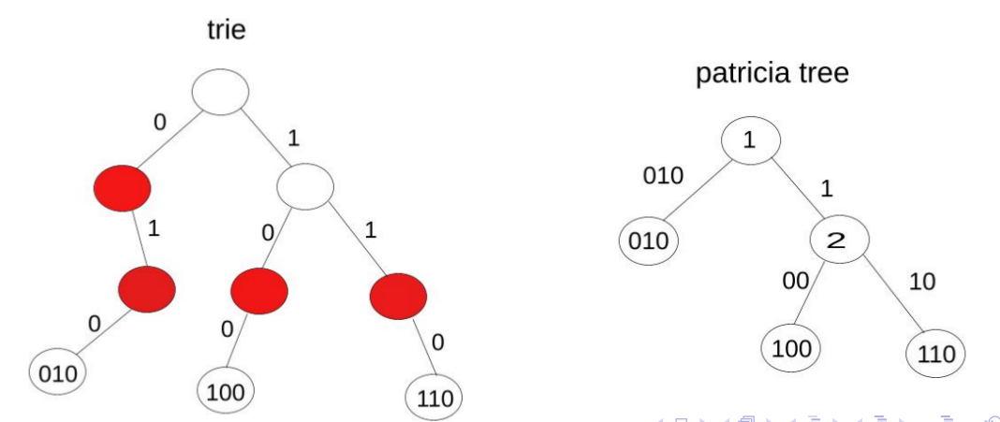
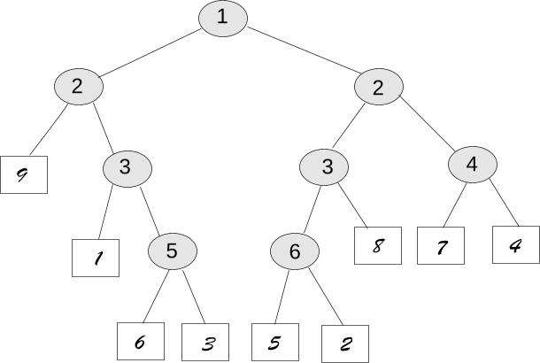

# Tree

## Hash Tree

​	hash树主要用到了质数分辨定理：因为N个不同的质数可以 ”辨别“ 的连续整数的数量，与这些质数的乘积相同。基本操作就是对一个插入的数据进行取模操作，对于每一层来讲，“模”的值也在变化，一般是从小到大的质数(2,3,5,7,11...)

结构如下案例所示：


#### 插入

​	已上图为例，在插入68的时候，首先从根节点出发，做取模运算，`68 mod 2 = 0`，往左子节点（0号孩子节点）走，左子节点以经被（78）占据，接下来继续取模`68 mod 3 = 2`，发现78的2号孩子节点被（74）占据，继续取模，`68 mod 5 = 3`，此时发现节点（74）的3号孩子节点为空，就可以将节点（68）插入。

#### 查找

​	查找操作类似上述插入过程找到相应的节点。

#### 删除

​	删除并不做物理上的删除，只是对删除的节点的占位标记置为`false`。

## Trie

​	Trie，也称字典树、单词查找树或键树，是一种哈希树的变种。起源于单词"retrive"，从根节点到每个叶子节点都代表一个字符串。比如字符"010","100","110"的表示如下：



该结构较为常用，它的实现如下：

```C++
#include <stdio.h>
#include <string>
#include <stdlib.h>
#include <string.h>
#include <iostream>
using namespace std;
struct TrieNode
{
    struct TrieNode *son[26]={NULL}; // 当前节点的所有孩子节点（26个字母）
    int num;    //有多少单词通过这个节点,即由根至该节点组成的字符串模式出现的次数
    char val;   //字母值
    bool isEnd=false;	//是否为最后一个节点
};

TrieNode* root;
void init(){
    root = new TrieNode();
    root->num=1;
}
//将string转化为char*
char* toCharArray(const string &str){
    int len=str.length();
    char *c=new char[len];
    for (int i = 0; i < len; ++i) {
       c[i]=str[i];
    }
    return c;
}
//为每个字符串在trie tree上创建一条路径
void creatTree(const string &str){
    if(str == "" || str.length() == 0){
        return;
    }
    TrieNode* node=root;
    char *c=toCharArray(str);
    for (int i = 0; i < str.length(); i++) {
        int pos = c[i] - 'a';	//相对数组的位置
        if(node->son[pos] == NULL ){ //如果pos位置的儿子节点没有被占用
            node->son[pos] = new TrieNode();
            node->son[pos]->val = c[i];
            node->son[pos]->num=1;
        }else{
            node->son[pos]->num++;
        }
        node=node->son[pos];
    }
    node->isEnd=true;
}

int query(const string &str){
    if(str == "" || str.length() == 0){
        return 0;
    }
    TrieNode* node = root;
    char *c = toCharArray(str);
    for (int i = 0; i < str.length(); i++) {
        int pos = c[i] - 'a';
        if( node->son[pos] == NULL){
            return 0;
        }else{
            node = node->son[pos];
        }
    }
    return node->num;
}
```


## Patrical Tree

​	在Trie Tree的基础上，对空间结构做了优化，在Trie Tree中只有一个孩子的节点会合并成一个节点，且且节点的左子树的路径被标记为0，右节点路径被标记为1，字符"010","100","110"在trie tree和patrical tree的表示如下：




## PAT tree

#### sistring

给定一个文本串，sistring指的是：

​	① 该文本串的子串

​	② 从该文本串的某个位置开始，直到该文本串的尾部。

例如：给定一个文本串`github`，该文本串的6个sistring分别是：`github`,`ithub`,`thub`,`hub`,`ub`,`b`。

该字符串有15个子串`github`,`githu`,`gith`,`git`,`gi`,`g`,`ithub`,`thub`,`thu`,`th`,`t`,`hub`,`hu`,`h`,`b`。

由此可知，仅通过存储n个sistring，通过前缀搜索，就可以得到n*(n+1)/2割字符串。

​	**PAT Tree**是一棵特殊的Patrical Tree，且一个字符串的所有sistring可以在该树上被表示。例如：一个字符串`str="010110110"`；该PAT树的结构如下（同时也是一棵patrical tree，如果某节点只有一个孩子节点就会合并成一个节点）：




sistring9 :  0

sistring8 :  10

sistring7 :  110

sistring6 :  0110

sistring5 :  10110

sistring4 :  110110

sistring3 :  0110110

sistring2 :  10110110

sistring1 :  010110110


## 参考资料

[Hash - 哈希树 (HashTree)](https://blog.csdn.net/chinaleesunnyboy/article/details/79689542)

[哈希树HashTree](https://wenku.baidu.com/view/16b2c7abd1f34693daef3e58.html)

[字典树(Trie树)实现与应用](https://www.cnblogs.com/xujian2014/p/5614724.html)